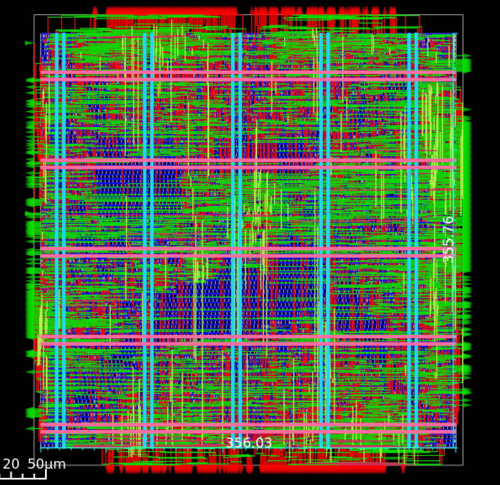

# SPI CNN Slave Project

Este módulo implementa un pequeño modulo SPI slave, Su función principal es recibe datos seriales (imagen y pesos) y los organiza de forma paralela para que la CNN pueda procesarlos.
El esclavo decide qué hacer basándose en los primeros 2 bits que recibe después de que CS_n baja. Estos bits forman el registro cmd:

Modos según el cmd:
2'b00 (LOAD IMAGE): Sirve para cargar la imagen de entrada.

Recibe los datos bit a bit y los agrupa en palabras de 28 bits (una fila de la imagen).

Llena la memoria image_mem (28 filas de 28 bits cada una).

2'b01 (LOAD WEIGHTS): * Sirve para cargar los pesos de la red neuronal.

Agrupa los bits en bytes (8 bits).

Los almacena en la memoria weight_mem.

2'b10 (START CNN):

Es un comando de disparo. En cuanto se detecta, la salida o_start_cnn se pone en '1' para activar el procesamiento interno.

2'b11 (READ RESULT):

Habilita la salida o_SPI_MISO.

Envía de forma serial el registro result (En trabajo).

## Resultados de la Implementación
A continuación se muestran los resultados obtenidos tras el flujo de síntesis y PnR:

### Layout Final (GDSII)

(hay que cambia el contador de 28 para pasar de registro a registro)

